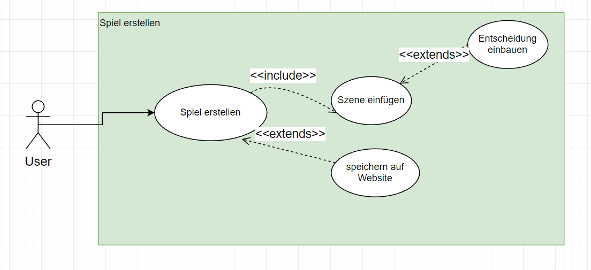

# System-Spezifikation Visual Novel

## 1. Ausgangslage 

### 1.1 Ist-Situation

Bei unserem Projekt geht es um eine Website, auf welcher man Visual Novels erstellen
kann. Eine Visual Novel ist ein Spiel, in welchem man vorgenerierte Entscheidungen
treffen kann und so verschiedene Geschichtszweige freischaltet.
Wichtige Fehler, die wir beheben wollen, werden im nachfolgenden Text angeführt.
Nachdem man eine Entscheidung getroffen hat, wird kurz ein alter Text wiederholt und
gleich darauf der eigentliche Text angezeigt. Dies kann Spielern den Eindruck geben,
einen Teil verpasst zu haben.
Im unteren Vergleich sieht man, dass das Spielfenster auf größeren Bildschirmen sehr
viel kleiner wirkt. Auch die Positionen der Figuren sind etwas verrückt, aufgrund der
unterschiedlichen Webbrowser (Oben: Chrome; Unten: Firefox).

Wir hatten mit der Zeit auch oft Probleme mit dem Server, da dieser oft nicht
funktioniert hat. Deswegen hat die Website, wenn der Server nicht funktionierte, die
Szenen aus der json-Datei, welche auf GitHub gespeichert ist, ausgelesen.

### 1.2 Verbesserungspotenziale

Wir wollen einen Visual Novel Maker hinzufügen, in welchen man seine eigenen VNs
erstellen, speichern kann. Auch die Funktionen unserer schon vorhanden VN wollen wir
in diesem Projekt verbessern.

### 1.3 Zielsetzung
- Verbesserung der alten Website

    - Fenstergröße responsive machen
        - Das Spielfenster soll sich an die Bildschirmgröße des Spielers anpassen. Ebenfalls
soll ein Vollbildmodus zur Verfügung stehen, bei dem die Navigationsleiste nicht
mehr zu sehen ist.
    - Positionsfehler beheben
        - Die Positionen der Charaktere sollen in jedem Browser gleich sein.
    - Zurück Button
        - Der Spieler soll in der Lage sein, zu dem vorherigen Text zurückzukehren, jedoch soll es nicht möglich sein, zu einer Entscheidung zurückzukommen und sie zu ändern.
    - Audio
        - Im Spiel gibt es ein Audio, in welchem der Text vorgelesen wird. Vorerst ist geplant den Text nur mit den Pronomen they/them vorzulesen, um geschlechtsneutral zu bleiben. Wenn genügend Zeit bleibt, werden die anderen zwei auch noch eingesprochen.
    - Pfadübersicht
        - Eine Übersicht, in der alle schon gespielten Szenen aufgelistet werden. Sie soll dem Spieler einen Überblick verschaffen

- Visual Novel Maker
    - Erstellen von Spielen: 
Mit dem Visual Novel Maker wird es einem ermöglicht, spiele zu erstellen.
    - Speichern von Spielen: 
Die erstellten Spiele werden auf der Website gespeichert und sind für jeden zugänglich.
- Accounts
    - Erstellen von einem Account: 
Man kann sich einen Account mit einem Usernamen, Passwort und E-Mail anlegen.
    - Speicherung des Spielstandes: 
Auf dem Account werden die Spielstände des Spielers gespeichert.

## 2. Funktionale Anforderungen
### 2.1. Use Case Überblick

Auf unserer Web-Site sind die 3 main use-cases:
- Ein Spiel erstellen
- Ein Spiel spielen
    - Nach dem Spielen kann man den Spielstand speichern, jedoch wird dafür ein Account benötigt.
- Einen Account erstellen

Ein Spiel zu erstellen beinhaltet das Erstellen von Szenen. Am Ende einer Szene kann man eine Entscheidung einbauen, wenn das Spiel fertig erstellt wurde, gibt es die Möglichkeit es auf der Web-Site zu speichern.