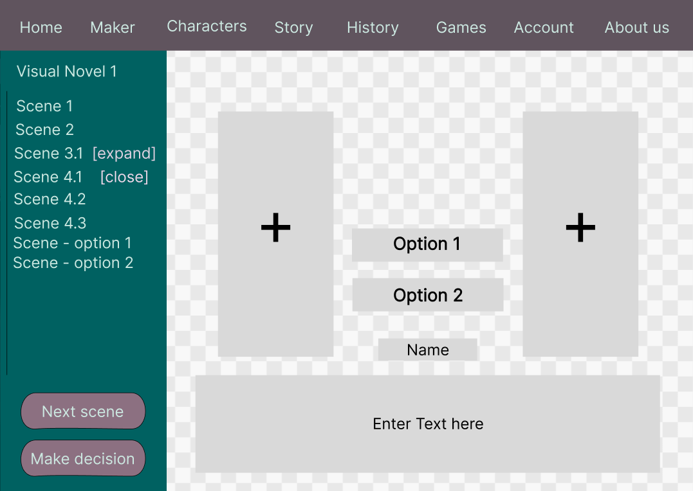

# System-Spezifikation Visual Novel

## 1. Ausgangslage 

### 1.1 Ist-Situation

Bei unserem Projekt geht es um eine Website, auf welcher man Visual Novels erstellen
kann. Eine Visual Novel ist ein Spiel, in welchem man vorgenerierte Entscheidungen
treffen kann und so verschiedene Geschichtszweige freischaltet.
Wichtige Fehler, die wir beheben wollen, werden im nachfolgenden Text angeführt.
Nachdem man eine Entscheidung getroffen hat, wird kurz ein alter Text wiederholt und
gleich darauf der eigentliche Text angezeigt. Dies kann Spielern den Eindruck geben,
einen Teil verpasst zu haben.
Im unteren Vergleich sieht man, dass das Spielfenster auf größeren Bildschirmen sehr
viel kleiner wirkt. Auch die Positionen der Figuren sind etwas verrückt, aufgrund der
unterschiedlichen Webbrowser (Oben: Chrome; Unten: Firefox).

 

Wir hatten mit der Zeit auch oft Probleme mit dem Server, da dieser oft nicht
funktioniert hat. Deswegen hat die Website, wenn der Server nicht funktionierte, die
Szenen aus der json-Datei, welche auf GitHub gespeichert ist, ausgelesen.

### 1.2 Verbesserungspotenziale

Wir wollen einen Visual Novel Maker hinzufügen, in welchen man seine eigenen VNs
erstellen, speichern kann. Auch die Funktionen unserer schon vorhanden VN wollen wir
in diesem Projekt verbessern.

### 1.3 Zielsetzung
- Verbesserung der alten Website

    - Fenstergröße responsive machen
        - Das Spielfenster soll sich an die Bildschirmgröße des Spielers anpassen. Ebenfalls
soll ein Vollbildmodus zur Verfügung stehen, bei dem die Navigationsleiste nicht
mehr zu sehen ist.
    - Positionsfehler beheben
        - Die Positionen der Charaktere sollen in jedem Browser gleich sein.
    - Zurück Button
        - Der Spieler soll in der Lage sein, zu dem vorherigen Text zurückzukehren, jedoch soll es nicht möglich sein, zu einer Entscheidung zurückzukommen und sie zu ändern.
    - Audio
        - Im Spiel gibt es ein Audio, in welchem der Text vorgelesen wird. Vorerst ist geplant den Text nur mit den Pronomen they/them vorzulesen, um geschlechtsneutral zu bleiben. Wenn genügend Zeit bleibt, werden die anderen zwei auch noch eingesprochen.
    - Pfadübersicht
        - Eine Übersicht, in der alle schon gespielten Szenen aufgelistet werden. Sie soll dem Spieler einen Überblick verschaffen

- Visual Novel Maker
    - Erstellen von Spielen: 
Mit dem Visual Novel Maker wird es einem ermöglicht, spiele zu erstellen.
    - Speichern von Spielen: 
Die erstellten Spiele werden auf der Website gespeichert und sind für jeden zugänglich.
- Accounts
    - Erstellen von einem Account: 
Man kann sich einen Account mit einem Usernamen, Passwort und E-Mail anlegen.
    - Speicherung des Spielstandes: 
Auf dem Account werden die Spielstände des Spielers gespeichert.

## 2. Funktionale Anforderungen
### 2.1. Use Case Überblick

Auf unserer Web-Site sind die 3 main use-cases:
- Ein Spiel erstellen
- Ein Spiel spielen
    - Nach dem Spielen kann man den Spielstand speichern, jedoch wird für das Speichern ein Account benötigt, weshalb nur
  eingeloggte User deren Spielstand speichern können.
- Einen Account erstellen

Ein Spiel zu erstellen beinhaltet das Erstellen von Szenen. Am Ende einer Szene kann man eine Entscheidung einbauen. 
Wenn das Spiel fertig erstellt wurde, gibt es die Möglichkeit es auf der Web-Site zu speichern. Nicht bei jeder Szene muss 
eine Entscheidung eingebaut werden, es kann auch einfach eine Szene ohne Entscheidung eingebaut werden. Nach entscheidungslosen Szenen 
wird einfach die darauf folgende Szene abgespielt.
 
Ebenso können erstellte Szenen mit rechtsklick auf die Szene wieder gelöscht werden.

### 2.2 Spiel erstellen
#### 2.2.1 Mock Up

An den Stellen, an welchen sich die '+' Symbole befinden, können Bilder der gerade interagierenden
Charaktere hinzugefügt werden. In der Box mit dem Schriftsatz 'Name' wird der Name der Person eingetragen,
welche gerade spricht oder denkt. 'Enter Text here' ist der Platzhalter für den gerade gesprochenen / gedachten Text.

Am Rand werden zur Übersicht die Szenen angezeigt, auf welche man klicken kann umm sie zu verändern oder neue hinzuzufügen.
Wenn die Szenen-Übersicht zu groß wird um auf der Seite vollständig angezeigt zu werden, kann man auf dem Rand der seite hinunter
Scrollen, um die nächsten Szenen bearbeiten zu können. Bei dem Button "next Scene" wird eine neue Szene erstellt und bei der Szenen-Übersicht wird diese hinzugefügt.

### 2.3 Entscheidung einbauen
#### 2.3.1 Mock Up

Bei einer Szene können genau zwei Entscheidungen eingefügt werden
(Option 1 und 2 sind die Entscheidungen, welche für das Spiel erstellt werden können).
 Die zwei Szenen (Scene - option 1 & Scene - option 2) sind die jeweiligen Szenen, bei denen der Spieler weiter spielt, je nachdem welche Option er nimmt.
 option 1 => es geht bei "Scene - option 1" weiter.
 option 2 => es geht bei "Scene - option 2" weiter.
 Die Namen "Scene - option" auf der Übersicht kann man jeweils noch mit einem Doppelklick ändern, 
um sie für einen selbst im editing-prozess verständlicher zu machen.

### 2.4 Spiel spielen/ Übersicht der vorhandenen Spiele
#### 2.4.1 Mock Up

In diesem Bild sieht man die Übersicht der bereits erstellten Spiele, welche man spielen kann.
Neben jedem Spiel steht eine kleine Beschreibung über das Spiel, der Name des Erstellers und das Erstelldatum.

### 2.5 Spielstände betrachten/fortsetzen
#### 2.5.1 Mock Up

Hier ist die Account übersicht, mit User-Name, E-Mail-Adresse und den Spielen, bei welchen man weiter
spielen kann.

## 3. Nicht-funktionale Anforderungen

### `Usability`: Benutzbarkeitsanforderung

Der Maker soll durch verschiedenste Buttons leicht bedienbar werden und durch die
'+' Symbol sollen Bilder auf einfachste Weise eingefügt werden können.

Durch eine klare Strukturierung der schon erstellten Szenen, soll dem benutzer eine 
gute Übersicht gegeben werden.